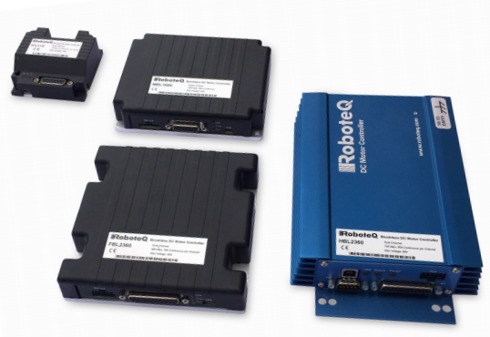

# roboteq_bridge #
#### ROS serial bridge for robotEQ power modules ####

### Protocol documentation ###
[Official robotEQ manual](https://www.roboteq.com/index.php/docman/motor-controllers-documents-and-files/documentation/user-manual/272-roboteq-controllers-user-manual-v17/file)

### Dependencies ###
http://wiki.ros.org/serial

### Configuration ###
#### Node parameters: ####
* port - _name of the port where the module is connected eg. /dev/ttyACM0_
* baud - _serial baud rate as set on the module_
* gear_ratio - _depends on the encoder placement, used for wheel velocity calculation_
* wheel_radius - _meters, used for wheel velocity calculation_
* wheel_separation - _meters, used for differential drive control_
* closed_loop - _true enables encoder configuration and periodic readout_
* report_angular_velocities - _on true reports angular wheel velocities on false reports tangent velocities_
*enable_twist_input* - _true enables differential drive service on /cmd_vel_

#### Parameters parsed to the module: ####
* watchdog_timeout - _milliseconds, stops drive after communication timeout_
* encoder_ppr - _number of pulses per encoder rotation_
* motor_amp_limit - _Amperes, internal current limit_
* motor_max_speed - _maximum allowed RPM on the encoder_
* motor_max_acceleration - _rpm/sec on encoder_
* motor_max_deceleration - _rpm/sec on encoder_

### Subscribers ###
* /cmd_vel - _twist command input_
* /base/wheel_cmd/right - _independent direct speed input for the right wheel (report_angular_velocities)_
* /base/wheel_cmd/left - _independent direct speed input for the left wheel (report_angular_velocities)_

### Publishers ###
* /base/wheel_vel/right - _right wheel velocity (report_angular_velocities)_
* /base/wheel_vel/left - _left wheel velocity (report_angular_velocities)_
